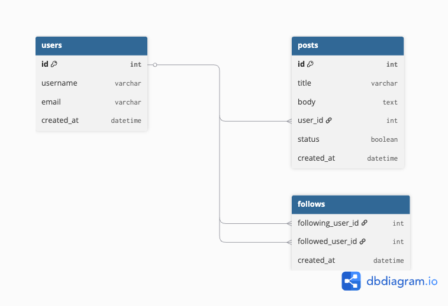

# Assignment

## Brief

Create an ERD for each of the following case study question.

## Instructions

Paste the answer as DBML in the answer code section below each question.

### Question 1

Construct an ERD for a social media company whose database includes information about users, their followers, and the posts that they make. Users can follow multiple users and create multiple posts.

Each entity has the following attributes:

- User: id, username, email, created_at
- Post: id, title, body, user_id, status, created_at
- Follows: following_user_id, followed_user_id, created_at

Answer:


```dbml


```

### Question 2

Construct an ERD for a company that sells books online. The company has a website where customers can browse available books and add them to their shopping carts. Each cart can contain multiple books.

There are 4 entities, think of what attributes each entity should have.

- Customer
- Book
- Cart
- CartItem

Answer:

```dbml

```

## Submission

- Submit the URL of the GitHub Repository that contains your work to NTU black board.
- Should you reference the work of your classmate(s) or online resources, give them credit by adding either the name of your classmate or URL.
